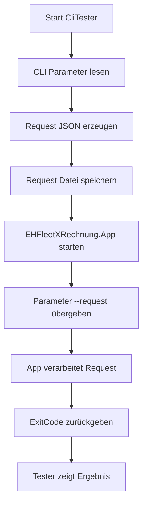

# EHFleetXRechnung.CliTester  
## Command Line Test Tool Dokumentation

---

# Überblick

**EHFleetXRechnung.CliTester** ist ein CLI-Testprogramm zur Simulation von CLI-Aufrufen der Anwendung **EHFleetXRechnung.App**.

Das Tool erzeugt automatisch eine **Request-JSON-Datei** und startet anschließend die Anwendung **EHFleetXRechnung.App** mit dem Parameter:

```
--request <RequestFile>
```

Damit können sämtliche CLI-Funktionen der Anwendung getestet werden, ohne die aufrufende VB6-Anwendung zu starten.

---

# Einsatzzweck

Typische Einsatzszenarien:

- Entwicklung und Debugging der CLI-Funktionalität
- Test der Request-JSON Struktur
- Simulation von VB6 Aufrufen
- Integrationstests
- Support- und Fehleranalyse
- Automatisierte Tests

---

# CLI Syntax

```
EHFleetXRechnung.CliTester <AppPath> <cmd> <invoiceType> <invoiceNo> [email]
```

---

# Parameter

| Parameter | Typ | Beschreibung |
|-----------|-----|-------------|
| AppPath | String | Pfad zur Anwendung **EHFleetXRechnung.App** |
| cmd | String | auszuführender CLI Command |
| invoiceType | String | Rechnungsart (WA / TA / MR) |
| invoiceNo | Integer | Rechnungsnummer |
| email | String | optionaler Email Empfänger |

---

# Beispielaufrufe

## Druckvorschau testen

```
.\EHFleetXRechnung.CliTester.exe "C:\Users\harzmann.EH-SYSTEMHAUS\source\repos\ehfleet_vb6guidll\EHWinFormViews.App\bin\Debug\net8.0-windows\EHFleetXRechnung.App.exe" invoice.printpreview WA 40
```

---

## XML Export testen

```
EHFleetXRechnung.CliTester "C:\Apps\EHFleet\EHFleetXRechnung.exe" invoice.export.xml WA 4711
```

---

## HybridPDF Export testen

```
EHFleetXRechnung.CliTester "C:\Apps\EHFleet\EHFleetXRechnung.exe" invoice.export.hybridpdf WA 4711
```

---

## XML Email Versand testen

```
EHFleetXRechnung.CliTester "C:\Apps\EHFleet\EHFleetXRechnung.exe" invoice.email.xml WA 4711 kunde@firma.de
```

---

## HybridPDF Email Versand testen

```
EHFleetXRechnung.CliTester "C:\Apps\EHFleet\EHFleetXRechnung.exe" invoice.email.hybridpdf WA 4711 kunde@firma.de
```

---

# Unterstützte Commands

| Command | Beschreibung |
|--------|-------------|
| invoice.printpreview | öffnet die Druckvorschau |
| invoice.export.xml | exportiert eine XRechnung XML |
| invoice.export.hybridpdf | exportiert eine HybridPDF |
| invoice.email.xml | versendet eine XML Rechnung per Email |
| invoice.email.hybridpdf | versendet eine HybridPDF Rechnung per Email |

---

# Rechnungsarten

| Code | Beschreibung |
|------|-------------|
| WA | Werkstattauftrag |
| TA | Transportauftrag |
| MR | Materialrechnung |

---

# Funktionsweise

Der CLI Tester führt folgende Schritte aus:

1. Validierung der CLI Parameter
2. Erzeugung einer Request-ID
3. Erstellung einer JSON Request-Datei
4. Speicherung der Datei im Ordner `requests`
5. Start der Anwendung **EHFleetXRechnung.App**
6. Übergabe des Parameters

```
--request <RequestFile>
```

7. Warten auf Beendigung der Anwendung
8. Ausgabe des ExitCodes

---

# Beispiel einer erzeugten Request-Datei

```json
{
  "version": 1,
  "requestId": "20260305-201530",
  "createdUtc": "2026-03-05T20:15:30Z",
  "user": "harzmann",
  "cmd": "invoice.printpreview",
  "payload": {
    "invoiceType": "WA",
    "invoiceNo": 4711
  }
}
```

---

# Ablaufdiagramm



---

# ExitCode Ausgabe

Nach Beendigung der Anwendung zeigt der CLI Tester den ExitCode an.

Beispiel:

```
Application finished
ExitCode: 0
```

---

# ExitCodes

| Code | Bedeutung |
|------|-----------|
| 0 | Erfolg |
| 2 | unbekannter Command |
| 3 | Validierungsfehler |
| 10 | technischer Fehler |

---

# Request Speicherort

Standardmäßig werden Request-Dateien im Ordner erstellt:

```
./requests
```

Beispiel:

```
requests/
 ├─ req_20260305-201530.json
 ├─ req_20260305-201845.json
```

---

# Integration mit EHFleetXRechnung.App

Der CLI Tester nutzt die gleiche Schnittstelle wie die produktive Anwendung.

```
EHFleetXRechnung.App --request <RequestFile>
```

Dadurch können alle CLI-Funktionen vollständig getestet werden.

---

# Vorteile des CLI Testers

| Vorteil | Beschreibung |
|--------|-------------|
| reproduzierbare Tests | Requests können gespeichert werden |
| einfache Integration | funktioniert ohne VB6 |
| Debugging | JSON Requests leicht analysierbar |
| Automatisierung | geeignet für Testskripte |
| Integrationstests | simuliert echte Anwendung |

---

# Projektstruktur

```
EHFleetXRechnung.CliTester
│
├─ Program.vb
├─ requests/
│   ├─ req_*.json
│
└─ EHFleetXRechnung.CliTester.exe
```

---

# Typischer Entwicklungsworkflow

1. Anwendung **EHFleetXRechnung.App** starten oder bauen
2. CLI Tester ausführen
3. gewünschte Funktion testen
4. ExitCode prüfen
5. Logs analysieren

---

# Beispiel Debug Session

```
EHFleetXRechnung.CliTester "C:\Apps\EHFleet\EHFleetXRechnung.exe" invoice.printpreview WA 4711
```

Ausgabe:

```
EHFleetXRechnung CLI Tester
--------------------------------

Request file created:
requests\req_20260305-201530.json

Starting application...

Application finished
ExitCode: 0
```

---

# Zusammenfassung

Der **EHFleetXRechnung.CliTester** ermöglicht eine einfache und reproduzierbare Testumgebung für alle CLI Funktionen der Anwendung **EHFleetXRechnung.App**.

Er simuliert exakt das Verhalten der produktiven Aufrufer wie:

- VB6 Anwendungen
- Scheduler Tasks
- Integrationen

und stellt damit ein wichtiges Werkzeug für Entwicklung, Test und Support dar.

---