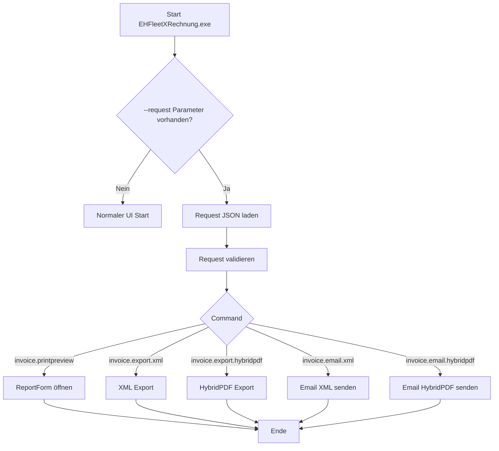
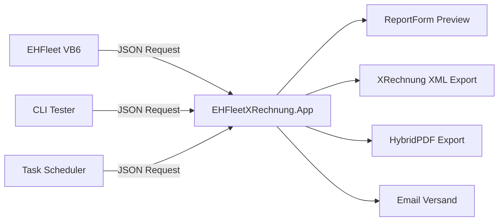

# EHFleetXRechnung.App  
## Command Line Interface (CLI) Dokumentation

---

# Überblick

Die Anwendung **EHFleetXRechnung.App** unterstützt einen **CLI-Modus**, um Funktionen automatisiert aus externen Anwendungen aufzurufen.

Typische Aufrufer:

- VB6 Anwendung **EHFleet Fuhrpark IM-System**
- Windows **Task Scheduler**
- externe Integrationen
- Testtool **EHFleetXRechnung.CliTester**

Die CLI arbeitet **dateibasiert über eine JSON Request-Datei**.

Dadurch werden folgende Probleme vermieden:

- Parameter-Längenbeschränkungen
- Quoting-Probleme
- komplexe Datenstrukturen

---

# CLI Aufruf

## Syntax

```text
EHFleetXRechnung.exe --request "<RequestFile>"
```

### Beispiel

```text
EHFleetXRechnung.exe --request "C:\Temp\req_20260305_201530.json"
```

---

# Request-Datei (JSON)

Die Request-Datei enthält alle notwendigen Informationen zur Ausführung der gewünschten Aktion.

## Schema

```json
{
  "version": 1,
  "requestId": "20260305-201530",
  "createdUtc": "2026-03-05T20:15:30Z",
  "user": "harzmann",
  "cmd": "invoice.printpreview",
  "payload": {
    "invoiceType": "WA",
    "invoiceNo": 4711,
    "to": "kunde@firma.de"
  }
}
```

---

# Felder der Request-Datei

| Feld | Typ | Beschreibung |
|-----|-----|-------------|
| version | Integer | Version des Request-Schemas |
| requestId | String | eindeutige Request-ID |
| createdUtc | DateTime | Zeitstempel der Erstellung |
| user | String | Benutzername |
| cmd | String | auszuführender Befehl |
| payload | Object | Parameter für den Befehl |

---

# Payload Parameter

| Parameter | Typ | Beschreibung |
|----------|-----|-------------|
| invoiceType | String | Rechnungsart (WA / TA / MR) |
| invoiceNo | Integer | Rechnungsnummer |
| to | String | Email Empfänger (nur für Email-Kommandos) |

---

# Rechnungsarten

| Code | Beschreibung |
|-----|-------------|
| WA | Werkstattauftrag |
| TA | Transportauftrag |
| MR | Materialrechnung |

---

# Unterstützte CLI Commands

## invoice.printpreview

Öffnet die **Rechnungsvorschau**.

### Verhalten

- Startet die GUI
- öffnet **ReportForm**
- zeigt Druckvorschau

### Beispiel

```json
{
  "cmd": "invoice.printpreview",
  "payload": {
    "invoiceType": "WA",
    "invoiceNo": 4711
  }
}
```

---

# invoice.export.xml

Exportiert eine **XRechnung XML Datei**.

### Verhalten

- läuft **headless**
- erzeugt XML Datei

### Beispiel

```json
{
  "cmd": "invoice.export.xml",
  "payload": {
    "invoiceType": "WA",
    "invoiceNo": 4711
  }
}
```

---

# invoice.export.hybridpdf

Exportiert eine **HybridPDF Rechnung**.

HybridPDF enthält:

- PDF Rechnung
- eingebettete XRechnung XML

### Beispiel

```json
{
  "cmd": "invoice.export.hybridpdf",
  "payload": {
    "invoiceType": "WA",
    "invoiceNo": 4711
  }
}
```

---

# invoice.email.xml

Versendet eine **XML Rechnung per Email**.

### Beispiel

```json
{
  "cmd": "invoice.email.xml",
  "payload": {
    "invoiceType": "WA",
    "invoiceNo": 4711,
    "to": "kunde@firma.de"
  }
}
```

---

# invoice.email.hybridpdf

Versendet eine **HybridPDF Rechnung per Email**.

### Beispiel

```json
{
  "cmd": "invoice.email.hybridpdf",
  "payload": {
    "invoiceType": "WA",
    "invoiceNo": 4711,
    "to": "kunde@firma.de"
  }
}
```

---

# CLI Flow Chart



---

# Request Lifecycle

Während der Verarbeitung kann die Request-Datei umbenannt werden.

| Status | Beschreibung |
|------|-------------|
| request.json | neue Anfrage |
| request.processing | Verarbeitung läuft |
| request.done | erfolgreich abgeschlossen |
| request.err.json | Fehler aufgetreten |

---

# Exit Codes

| Code | Bedeutung |
|-----|-----------|
| 0 | Erfolg |
| 2 | unbekannter Command |
| 3 | Validierungsfehler |
| 10 | technischer Fehler |

---

# Beispiel CLI Aufruf

## PrintPreview

```text
EHFleetXRechnung.exe --request "C:\Requests\req_preview.json"
```

---

## XML Export

```text
EHFleetXRechnung.exe --request "C:\Requests\req_export.json"
```

---

# Testtool

Zum Testen der CLI steht das Tool

```
EHFleetXRechnung.CliTester
```

zur Verfügung.


---

# Vorteile der JSON Request Architektur

| Vorteil | Beschreibung |
|------|-------------|
| stabil | keine CLI Quoting Probleme |
| erweiterbar | Payload kann beliebig erweitert werden |
| auditierbar | Requests können gespeichert werden |
| debugfähig | reproduzierbare Testfälle |
| integrationsfähig | ideal für Automatisierung |

---

# Integration in VB6

Die VB6 Anwendung erzeugt eine Request-Datei und startet anschließend:

```vb
Shell("EHFleetXRechnung.exe --request ""C:\Requests\req_4711.json""")
```

---

# Architekturübersicht



---